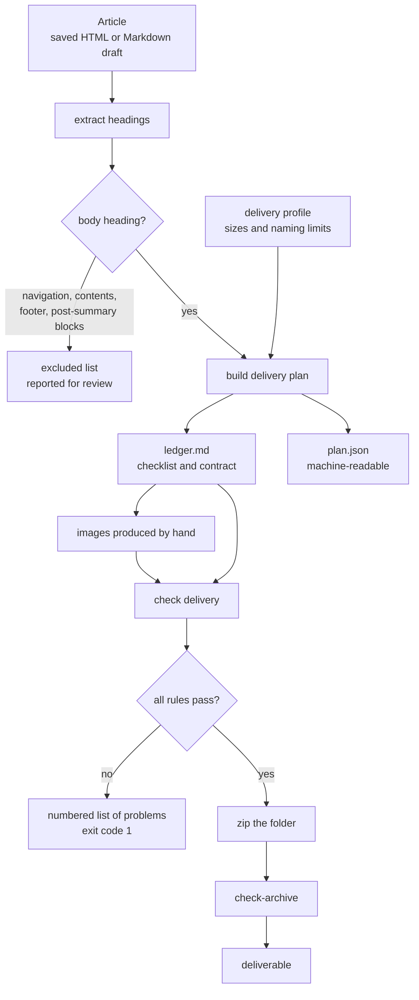

# blog-asset-pipeline

**English** | [日本語概要](README.ja.md)

A command line tool that reads an article, works out exactly which images it
needs, and refuses to let an incomplete or malformed image package be
delivered.

It automates **extraction, planning, validation and packaging**. It does not
generate images — that step is still a person driving an image tool, and the
tool's job is to make sure what comes back is complete, correctly sized,
correctly named and correctly described.

```
blog-assets plan  article.html --out delivery/   # what images are needed
#            ... produce the images ...
blog-assets check delivery/                      # is the package deliverable?
blog-assets check-archive delivery/ delivery.zip # is the archive clean?
```

## The problem this solves

I produce image sets for articles as ongoing paid work. Each article needs one
header image, one image per body heading, and one square image for social
media. Each image has a fixed size, a position-numbered filename, and an alt
text. The package is delivered as a zip.

Doing that by hand fails in ways that are invisible until the client opens the
files:

| Failure | Why it is invisible | How it is caught here |
|---|---|---|
| A heading is missed | The saved page mixes article text with navigation, a contents box and shared footer blocks | The parser reports every heading it *excluded* and why, instead of silently dropping it |
| The upload is rejected | The CMS counts filename length in **bytes**, so a 20-character non-Latin heading blows a 40-byte budget | Names are trimmed on a byte budget without splitting a character |
| A file "goes missing" | macOS stores filenames decomposed (NFD), the ledger holds them composed (NFC) | Both sides are normalised before comparison |
| An image is the wrong shape | Nobody re-measures after a crop | Dimensions are read from the file header and compared to the plan |
| A draft ships | It is sitting in the same folder | Any image not in the ledger is a failure |
| Alt text is forgotten | It lives in a separate file | Every delivered file must appear in the alt text file |
| The zip contains junk | Working sub-folders and hidden files get swept in | The archive is compared entry by entry against the folder |

## What this repository demonstrates

- Turning an informal, error-prone manual routine into a checked pipeline.
- Parsing input that is *not* well-formed, and reporting what was discarded
  rather than failing silently.
- Handling text correctly: byte-vs-character length, Unicode normalisation,
  and encoding detection that prefers a declared charset over a guess.
- Removing a platform dependency: the original used the macOS-only `sips`
  command to measure images. It now reads PNG, JPEG, GIF and WebP headers
  with the standard library, so it runs on Linux and Windows too, and in CI.
- Tests that each break exactly one rule of a known-good delivery.

## Data flow



The ledger is the pivot. It is Markdown rather than JSON on purpose: the
person producing the images edits the progress columns by hand while working,
so it has to survive being opened in a text editor. The parser locates the
table by its header row and matches columns **by name**, so adding a column
does not shift the checker off the filename.

## Install

Requires Python 3.9 or newer. No runtime dependencies.

```bash
git clone https://github.com/sean-from-japan/blog-asset-pipeline.git
cd blog-asset-pipeline
python -m venv .venv && source .venv/bin/activate
pip install --upgrade pip     # editable installs need pip 21.3 or newer
pip install -e .
pip install -r requirements-dev.txt   # only needed to run the tests
```

## Use

```bash
# 1. Plan: read the article, write ledger.md and plan.json into the folder.
blog-assets plan tests/fixtures/sample_article.html --out delivery/

# 2. Produce the images into delivery/, write delivery/alt-text.md,
#    and mark the Generated / Reviewed / Alt columns "yes" as you go.

# 3. Check the folder. Exit code 1 means it is not deliverable.
blog-assets check delivery/

# 4. Zip it, then check the archive against the folder.
blog-assets check-archive delivery/ delivery.zip
```

Re-running `plan` on a folder that already has a `ledger.md` writes
`ledger.new.md` instead, so recorded progress is never destroyed. `--force`
overrides that.

### Delivery profiles

Every size and naming limit lives in a profile, so a second client with
different requirements needs a JSON file, not a code change:

```json
{
  "name": "wide-format",
  "header": "1920x1080",
  "body": "1200x900",
  "square": "1080x1080",
  "max_filename_bytes": 60
}
```

```bash
blog-assets plan article.html --profile profiles/wide-format.json --out delivery/
```

## Key decisions

**Read image headers instead of shelling out.** `sips` is macOS-only and
launching a process per image is slow. Four container formats are parsed
directly from their first 30 bytes (JPEG needs its segment table walked,
because the frame header is not at a fixed offset). No image library, no
platform lock-in, and CI can run the same check the laptop runs.

**Report exclusions, never drop silently.** The parser removes headings from
navigation, contents boxes, footers and the shared blocks that follow the
summary. Every removal is listed with its reason, and if more headings were
excluded than kept, the run warns that the page was probably saved in an
unexpected form. A silently missing heading is the one failure that reaches
the client.

**Recover from malformed markup.** An unclosed `<h2>` used to swallow the next
heading. Opening a block-level element or another heading now closes the
current one and flags it, so the heading survives with a note instead of
vanishing.

**Byte budgets, not character counts.** Filename limits are enforced in UTF-8
bytes and trimmed without splitting a character. The budget also accounts for
the `NN_` prefix, the extension, and the `_sq` suffix the square image adds.

**Normalise before comparing.** Filenames are compared in NFC, because macOS
writes NFD to disk while editors write NFC.

**The checker is a diff, not a linter.** Validation compares the ledger, the
folder and the alt text file against each other. Three sources have to agree
before a delivery passes.

### Alternatives considered

- *JSON as the working checklist.* Rejected: it is edited by hand mid-task,
  and a stray comma would break the run at the worst moment. `plan.json` is
  still written for tooling, but it is an output, not the checklist.
- *Pillow for image dimensions.* Rejected: a compiled dependency to read four
  header layouts, for a tool that otherwise needs nothing.
- *Slugifying headings to ASCII.* Rejected: the client identifies images by
  reading the filename. Readability is worth the byte budget arithmetic.
- *Failing on the first problem.* Rejected: the point is to fix everything in
  one pass, so all problems are reported together.

## Privacy and client confidentiality

This repository contains **no client material**. The workflow it automates is
real, but the client, their articles, their images, their sizes, their prompt
text and their delivery history are not in this repository and never were —
the tool was rebuilt here from the general problem, with fresh Git history.

Everything under `tests/fixtures/` is invented for this repository. Every
image used in the tests is generated byte by byte at test time
(`tests/conftest.py`), so no binary asset is committed at all.

## Tests

```bash
pytest          # 69 tests
ruff check .    # lint
ruff format --check .
```

CI runs the suite on Linux, macOS and Windows against Python 3.9 and 3.13,
plus a command line smoke test, on every push.

The delivery tests work by building a package that passes, then breaking
exactly one rule per test — a missing file, a wrong size, an empty file, a
stray image, an unfinished progress column, a missing alt text, a
decomposed filename on disk.

## Limitations

- **Alt text presence, not quality.** The checker confirms that every
  delivered file has an alt text entry. It cannot judge whether the text is
  useful.
- **Heading detection is heuristic.** It is tuned for pages saved from a
  content management system. A hand-built page with unusual markup may need
  headings added to the ledger by hand — which is why exclusions are printed.
- **Summary detection is English-only.** The rule that trims shared blocks
  after the summary matches English headings. Another language needs the
  pattern extended.
- **Four image formats.** PNG, JPEG, GIF and WebP. AVIF and HEIC are not
  parsed, and are reported as unsupported rather than guessed at.
- **No image generation or resizing.** Deliberately out of scope: the tool
  checks the work, it does not do it.

## Licence

MIT — see [LICENSE](LICENSE). All code, documentation and fixtures here are my
own work; no third-party code or assets are included.
