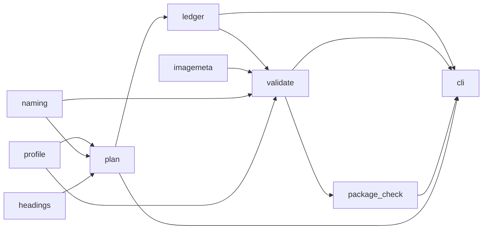

# Architecture

## Modules

| Module | Responsibility | Depends on |
|---|---|---|
| `profile` | Sizes and naming limits for one client or CMS | — |
| `naming` | Sanitising, byte budgets, Unicode normalisation, numbering | — |
| `imagemeta` | Image dimensions from file headers | — |
| `headings` | Parsing an article into headings, with exclusions | — |
| `plan` | Headings + profile → the list of images required | `headings`, `naming`, `profile` |
| `ledger` | Rendering and re-parsing the Markdown checklist | `plan` |
| `validate` | Folder vs ledger vs alt text | `ledger`, `imagemeta`, `naming`, `profile` |
| `package_check` | Archive vs folder | `validate` (report type only) |
| `cli` | Argument parsing, output, exit codes | all of the above |

The dependency graph is acyclic and one-directional. `naming`, `imagemeta` and
`profile` have no internal dependencies at all, which is why they are the
easiest parts to test exhaustively.

## Why the ledger sits in the middle

The plan is produced once, at the start. The images arrive hours or days
later, produced by a human. Something has to carry the intent across that gap
and record progress through it, and it has to be editable by the person doing
the work.

That is the ledger. It is the *contract*: the checker never re-parses the
article, it only compares the folder against the ledger. This means a heading
added to the ledger by hand — after reviewing the exclusions list — is
first-class, and the checker enforces it exactly like an automatically
extracted one.

## Exit codes

| Code | Meaning |
|---:|---|
| 0 | Everything checked passed |
| 1 | The article yielded no images, or the delivery has problems |
| 2 | The input could not be used at all: missing file, unreadable profile, unparseable ledger |

Separating 1 from 2 matters in a shell pipeline: 1 means "look at the report",
2 means "you passed me the wrong thing".

## Validation rules

Applied by `blog-assets check`:

1. `ledger.md` exists and yields at least one delivery row.
2. Row 1 is the header image; the last row is the square image; there is
   exactly one square image.
3. Ledger positions are 1..n with no gaps.
4. No filename is listed twice.
5. Every listed file exists on disk (compared in NFC) and is not empty.
6. Every filename is within the profile's UTF-8 byte limit.
7. Every filename carries its correct `NN_` position prefix.
8. Every file's real pixel dimensions match the ledger.
9. `alt-text.md` exists and mentions every delivered filename.
10. Every progress column is marked done.
11. No image in the folder is missing from the ledger.

Applied by `blog-assets check-archive`:

1. The archive opens and every entry passes its checksum.
2. No entry appears twice.
3. No entry is inside a sub-folder.
4. No hidden file is included.
5. The archive's file list equals the delivery folder's file list, both ways.
